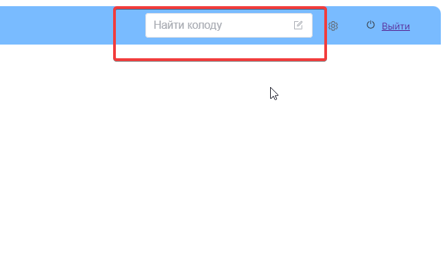

# Выполненно:
- [x] установить pinia

# Следует сделать:
- [ ] сделать репозиторий, произвести пуш
- [x] как сделать так чтобы я мог  я мог автоматически добавлять стили к классам написанными мною
  - скаччать tailwind
- узнать как мне реализовать возможность преезаписывать стили ellementplus блоков
  - как мне сделать более закруглённые поля для 

# Колоды:
- [ ] отобразить колоды как тут https://www.telerik.com/kendo-vue-ui/components/layout/card/layouts/
- [ ] понять как сделать slider колод
  - [ ] реализовать свайп5ер колод как тут https://blog.canopas.com/implement-different-types-of-sliders-using-vue-3-and-swiper-7-ab79bd5abe28#:~:text=Swiper%20%D1%82%D0%B0%D0%BA%D0%B6%D0%B5%20%D0%BC%D0%BE%D0%B6%D0%BD%D0%BE%20%D0%BD%D0%B0%D1%81%D1%82%D1%80%D0%BE%D0%B8%D1%82%D1%8C%20%D0%B4%D0%BB%D1%8F%20%D0%B4%D0%BE%D0%B1%D0%B0%D0%B2%D0%BB%D0%B5%D0%BD%D0%B8%D1%8F
  - или так
    - https://codesandbox.io/p/sandbox/7nmqp4?file=%2Findex.html
    - https://www.telerik.com/kendo-vue-ui/components/layout/card/layouts/
  - 
- [ ] понять как сделать добавление колод в main